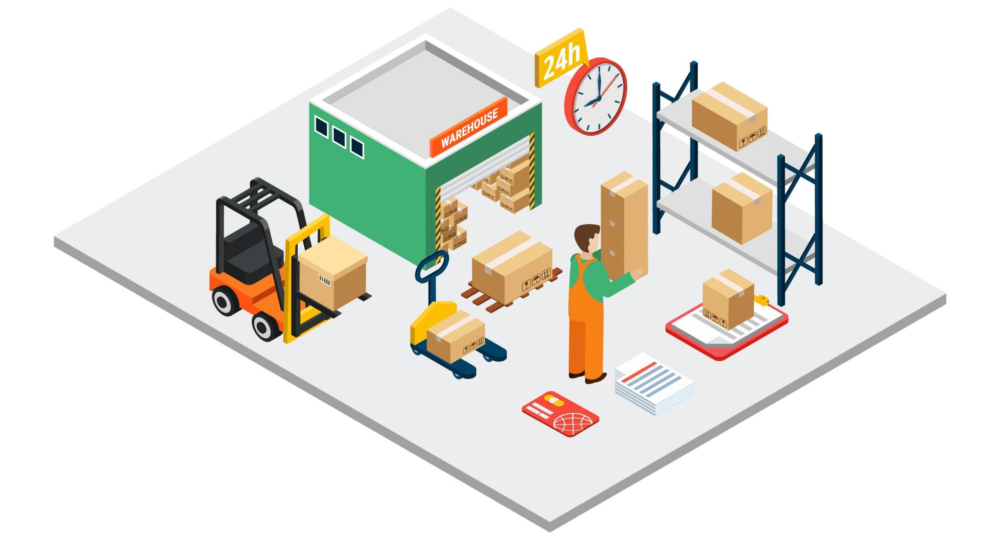

## 👋 Hi there!

I’m Courtney Chen, a Master of Data Science student at UC Berkeley (go Bears!) with a passion for statistics, machine learning, and LLMs. With a background in strategy, data science, and operations research, I enjoy developing data-driven models, experimenting with algorithms, and implementing optimization techniques in code to improve efficiency and decision-making.

## 💻 Projects

### [Second-Price Auction Simulator with Strategic Bidding](https://github.com/courtneyjchen/python-auction-simulator)
In this project, I developed an object-oriented ad auction simulator in Python to model a second-price auction environment. Bidders use an epsilon-greedy strategy with exponential decay to balance exploration of user click behavior and exploitation to maximize profit. My strategy proved successful in competition by applying a simple yet effective reinforcement learning framework.

### [Neo4j-Based Warehouse Optimization and Recommendations](https://github.com/courtneyjchen/neo4j-product-clustering)
Here, I used Neo4j to transform the Northwind Traders sales database into a product co-purchase graph, applying algorithms such as Louvain, Triangle Count, and PageRank to detect communities and identify influential products. These insights informed the optimal warehouse placement of related items and powered a recommender system that suggests highly co-purchased products.

### [Predicting Language Endangerment with Machine Learning](https://github.com/courtneyjchen/python-language-endangerment)
This project leverages machine learning to predict language endangerment across five levels, from Not Endangered to Extinct. Using socio-economic and geographic features such as speaker counts, political recognition, and internet access, it applies multiple modeling techniques to reduce overfitting and surpass baseline performance,demonstrating how data science can support efforts in linguistic preservation.

### [Minimizing Lending Risk through Predictive Modeling](https://github.com/courtneyjchen/r-loan-policy)
Using R, a team and I developed a logistic regression model to predict loan repayment using borrower financial history. We paired this with a profit analysis to identify the optimal decision threshold that maximized expected profit while reducing risk. This approach significantly improved profitability, demonstrating how a data-driven approach to lending can reduce risk for a business.

 

## 👩🏻‍💼 About Me

📝 I'm currently taking a GenAI course, where I'm learning how to train, deploy, and use LLMs.

📖 I’m passionate about [data storytelling](https://docs.google.com/presentation/d/1jd0hS2ZM2GFfSQgVZKkYWkE8Ju6gczUd2knHMzNJ374/edit?usp=sharing), which I see as essential to bridging the "last mile" between insight & action.

⚡️ My hobbies include working out, cooking, reading, and playing pickleball.

📫 Connect with me: [LinkedIn](https://www.linkedin.com/in/courtneyjchen/)
