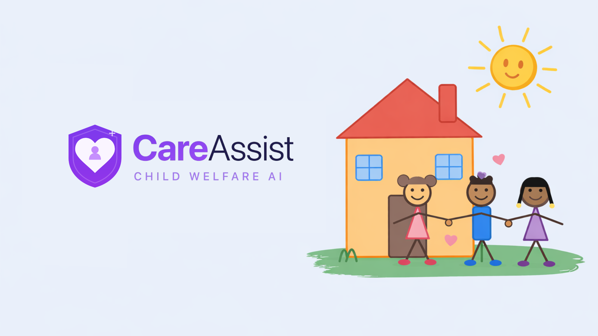

## Hi, I'm Courtney!

👩🏻‍💼 Data scientist focused on applied ML, NLP, and data systems.

💼 Background in strategy, operations research, and scalable analytics.

💡 Turning messy data into thoughtful tools for better decisions.

## Tech Stack

## Projects

### [CareAssist: An AI-Driven Case Prioritization Tool for Foster Care](https://github.com/courtneyjchen/careassist-foster-care-ai)
Using Angular, PostgreSQL, and machine learning, my team built CareAssist, an AI-driven platform that identifies early warning signs of placement disruption. The system enables social workers to proactively prioritize at-risk cases, improving continuity of care through predictive analytics, role-based dashboards, & a unified case management platform.

### [Second-Price Auction Simulator with Strategic Bidding](https://github.com/courtneyjchen/python-auction-simulator)
In this project, I developed an object-oriented ad auction simulator in Python to model a second-price auction environment. Bidders use an epsilon-greedy strategy with exponential decay to balance exploration of user click behavior and exploitation to maximize profit. My strategy proved successful in competition by applying this effective reinforcement learning framework.

### [Neo4j-Based Warehouse Optimization and Recommendations](https://github.com/courtneyjchen/neo4j-product-clustering)
Using Neo4j, I transformed the Northwind Traders sales database into a product co-purchase graph, applying algorithms such as Louvain, Triangle Count, and PageRank to detect communities and identify influential products. These insights informed the optimal warehouse placement of related items and a recommender system that suggests highly co-purchased products to users.

### [Distributed Flight Delay Prediction with PySpark](https://github.com/courtneyjchen/pyspark-flight-delay-prediction)
Using PySpark, my team built a distributed ML pipeline to predict flight delays using 31M+ aviation records. We engineered scalable preprocessing workflows, custom distributed joins, and time-aware features, then applied sliding window cross-validation to evaluate machine learning models in a distributed computing environment.

### [Predicting Language Endangerment with Machine Learning](https://github.com/courtneyjchen/python-language-endangerment)
This project leverages ML to predict language endangerment across five levels, from Not Endangered to Extinct. Using socio-economic and geographic features such as speaker counts, political recognition, and internet access, it applies models, such as gradient boost, to highlight how data science can support linguistic preservation efforts.

### [Minimizing Lending Risk through Predictive Modeling](https://github.com/courtneyjchen/r-loan-policy)
Using R, a team and I developed a logistic regression model to predict loan repayment using borrower financial history. We paired this with a profit analysis to identify the optimal decision threshold that maximized expected profit while reducing risk. This approach significantly improved profitability, demonstrating how a data-driven approach to lending can reduce risk for a business.

 

## Fun Facts

💻 Recently completed graduate work in GenAI, focused on LLM fine-tuning, prompt optimization, and scalable deployment.

📖 Passionate about data storytelling as a bridge between numbers and decisions.
